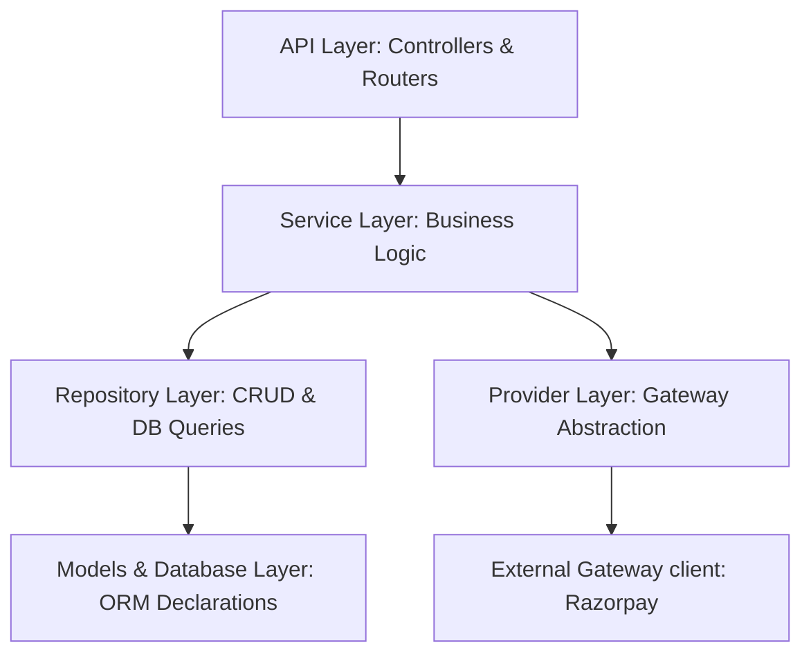

# BharatTruck Payment Service Architecture Documentation

This document describes the architectural layout, core design patterns, layer boundaries, dependency flow, and operational workflows of the BharatTruck Payment Service.

---

## 1. Clean Architecture & Layer Responsibilities

The service is designed around the principles of **Clean Architecture** to enforce separation of concerns, facilitate unit testing, and keep core business policies decoupled from transport protocols, external gateways, and database details.

### Layer Breakdown:
1. **API Layer (`app/api`)**:
   - Acts as the entry point and transport controller boundary (REST/HTTP).
   - Responsible for routing requests, deserializing/serializing HTTP payloads, parsing headers (e.g., webhook signatures), and invoking the appropriate Service methods.
   - Leverages **Pydantic Schemas** (`app/schemas`) to validate requests and document standard outputs.
   - 中央 Exception Handler translates custom business exceptions into HTTP JSON status codes (400, 404, 409).
2. **Service Layer (`app/services`)**:
   - Represents the core application orchestrator.
   - Enforces all business logic, workflow rules (e.g. "escrow is created only for captured payments"), and transactional policies.
   - Declares domain-specific business exceptions (`ResourceNotFound`, `InvalidStateTransition`, `ConflictError`).
   - Completely decoupled from transport layer details; it has no knowledge of FastAPI, HTTP status codes, or raw requests.
3. **Repository Layer (`app/repositories`)**:
   - Provides a clean abstraction for database persistence.
   - Inherits CRUD functions from `BaseRepository`, minimizing database query boilerplate.
   - Uses SQLAlchemy 2.0 type-safe constructs (`select()`, `db.scalars()`) to translate domain queries into database commands.
4. **Provider Layer (`app/providers`)**:
   - Abstract payment gateway client interface (`PaymentProvider`) defining the contract for operations like creating orders and verifying webhook signatures.
   - Implemented by concrete classes (e.g., `RazorpayProvider`), protecting the application from breaking changes in third-party API contracts.
5. **Database & Model Layer (`app/models` & `app/db`)**:
   - Defines SQLAlchemy Declarative ORM models representing the core schemas (`payment`, `escrow_transaction`, `pod_event`, `webhook_event`, `audit_log`).
   - Manages connection pools and session lifecycles.

---

## 2. Rationale for Core Architectural Decisions

- **Dependency Inversion**: Outer layers (API, Repositories) depend on inner abstractions (Service interface contracts). The Service layer remains pure Python code, depending only on the abstract contracts.
- **Dependency Injection**: We use constructor dependency injection throughout the service layer. FastAPI's `Depends` system resolves and injects session databases, repositories, and provider instances at the API gateway router level. This facilitates mocking external components in unit testing.
- **Fail-Fast Configuration**: Settings are loaded via `Pydantic Settings` and strictly validated at boot time. If required variables are missing or incorrectly configured, the app crashes immediately to prevent running in a corrupted state.
- **Centralized Exception Mapping**: All domain errors are captured by a centralized exception handler. This separates business rules (which raise domain exceptions) from the transport layer (which maps them to HTTP responses).

---

## 3. Core Business Workflows

### A. Payment Order Creation
1. API receives a POST request to `/payments/create-order` with a `booking_id` and `amount`.
2. PaymentService checks the repository to ensure no `CAPTURED` payment already exists for the booking.
3. A local Payment record is created in the `CREATED` state.
4. PaymentService calls `PaymentProvider.create_order()` to register the payment request with Razorpay.
5. The Payment record is updated to `INITIATED` with the provider order ID and returned.

### B. Webhook Handling & Idempotency
1. Razorpay emits a `payment.captured` event to the `/webhooks/razorpay` endpoint.
2. API validates the signature using the configured webhook secret.
3. WebhookService checks the `webhook_event` table for the unique event ID to guarantee idempotency.
4. If unprocessed, the WebhookEvent state transitions to `PROCESSING`.
5. WebhookService fetches the Payment record matching the order ID, updates its status to `CAPTURED`, and stores the provider payment ID.
6. The event is updated to `PROCESSED` with a timestamp.

### C. Escrow Hold & Release Lifecycle
1. When WebhookService transitions a Payment to `CAPTURED`, it automatically invokes `EscrowService.create_escrow()`.
2. EscrowService idempotently creates an `EscrowTransaction` in the `HELD` state for the payment amount.
3. An `AuditLog` entry is generated documenting the escrow creation.
4. When a request to release escrow is triggered via POST `/escrow/payment/{payment_id}/release`:
   - EscrowService verifies that:
     1. Payment status is `CAPTURED`.
     2. Escrow status is `HELD` (not already released).
     3. A verified Proof of Delivery exists for the booking (calling `pod_service.has_verified_pod()`).
   - If conditions are met, the escrow transitions to `RELEASED` with a release timestamp and name of the release authority (defaults to `"system"`).
   - An `AuditLog` entry is logged.

### D. Proof of Delivery (POD) Lifecycle
1. API receives a POST `/pod/upload` containing a `booking_id` and a `photo_url`.
2. PodService registers a new `PodEvent` in the `UPLOADED` state.
3. Transporter/shipper requests verification via POST `/pod/{pod_id}/verify`.
4. PodService checks if a verified POD already exists for the booking. If so, it raises a `ConflictError` (HTTP 409) to enforce that only one active delivery confirmation exists.
5. If no conflict exists, the POD status is updated to `VERIFIED` and `verified_at` timestamp is set.
6. **Note:** POD verification *never* triggers escrow release directly; they remain separated to allow manual approval checks or secondary administrative steps.
